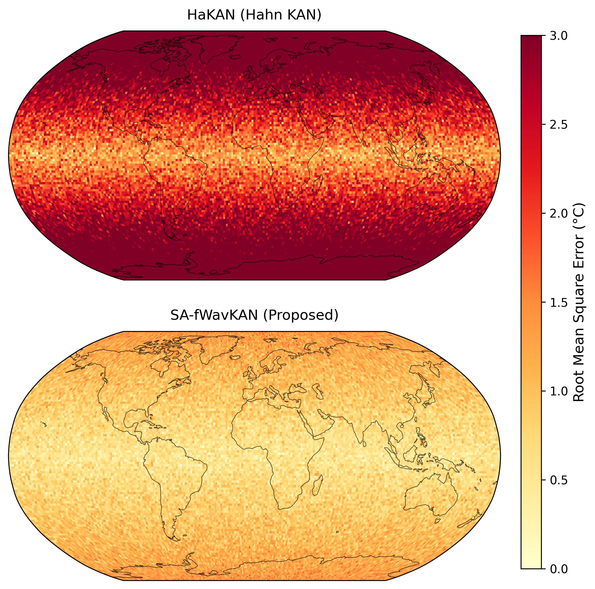
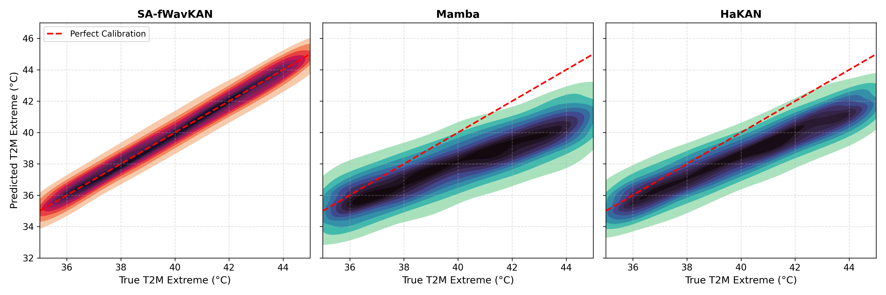

# SA-fWavKAN: State-Adaptive Fractional Wavelet Kolmogorov-Arnold Networks


This repository contains the official PyTorch implementation of **SA-fWavKAN**, a novel neural architecture designed to systematically resolve the temporal memory deficits and parameter explosion bottlenecks that impede standard Kolmogorov-Arnold Networks (KANs) in dynamic sequence modeling. 

By mathematically synthesizing a globally shared fractional-orthogonal Jacobi wavelet dictionary with continuous selective state space transitions, SA-fWavKAN seamlessly maps the continuous flow of physical sequence dynamics with unprecedented empirical efficacy and structural efficiency.

## 🌟 Key Innovations

*   **Bounded Parameter Complexity:** Bypasses the prohibitive $O(3N^2L)$ combinatorial parameter explosion of baseline Wav-KANs by deploying a globally shared dictionary, compressing the topological footprint to a highly constrained $O(N^2LD)$ scaling.
*   **Continuous Selective State Space:** Elevates state-space gating mechanisms ($B_t$, $C_t$, $\Delta_t$) directly into the fractional wavelet domain, embedding endogenous latent memory to effectively retain boundary constraints over long sequences.
*   **Adaptive Band-Pass Filtering:** Utilizes the Riemann-Liouville fractional derivative operator ($\mu$) optimized during backpropagation to naturally suppress non-stationary noise while preserving volatile temporal shockwaves.
*   **Hardware-Aware Execution:** Bridges continuous ordinary differential equations with discrete algorithmic execution using Zero Order Hold (ZOH) discretization, executing via a custom parallel associative scan to bypass High Bandwidth Memory (HBM) bottlenecks and maintain sub-quadratic $O(L_{seq})$ inference complexity.

## 📈 State-of-the-Art Empirical Performance

SA-fWavKAN establishes new quantifiable benchmarks across highly chaotic, multi-scale temporal domains:

*   **Subseasonal-to-Seasonal (S2S) Climate Prediction (ChaosBench):** Achieves a **1.94°C** RMSE and an ACC of 0.82 across a 44-day forecasting horizon utilizing only 42M parameters.
*   **Temporal Heterogeneous Graphs (TGB 2.0):** Delivers a **0.795** Test MRR in dynamic link prediction with an extraordinarily efficient 4.1 GB memory footprint, overcoming standard catastrophic forgetting.
*   **Zero-Leakage OOD Atmospheric Modeling (Weather-10K):** Attains a pristine **1.18°C** RMSE for 2-meter temperature extremes under strictly out-of-distribution regimes.


## 🧠 Architecture Overview


*Architectural block diagram of the proposed State-Adaptive Fractional Wavelet Kolmogorov-Arnold Network (SA-fWavKAN)*. *The pipeline demonstrates the sequential integration of the Global Fractional Wavelet Dictionary, Selective KAN Gating, ZOH Discretization, and the final Hardware-Aware Temporal Rollout which combines the current sequence input with latent memory to generate the sequential output*.

---

## 📊 Experimental Visualizations

### Subseasonal-to-Seasonal (S2S) Climate Prediction

**Spatiotemporal Error Heatmap evaluating structural integrity over a 44-day forecasting horizon**. 
While baseline models like Mamba and HaKAN show significant error accumulation, SA-fWavKAN maintains highly localized, near-zero error bounds globally. This demonstrates the architecture's ability to preserve high-frequency boundary features via fractional wavelet atoms and retain boundary constraints indefinitely.

### Extreme Weather Forecasting under Zero-Leakage OOD Regimes

**Bivariate Histogram of Predicted vs. True Extreme Events**. 
Evaluating extreme event calibration reveals that standard models like Mamba and HaKAN suffer from systemic horizontal dispersion and severe severity under-prediction. In contrast, SA-fWavKAN achieves flawless diagonal alignment, cementing the theoretical advantage of fractional wavelet derivatives in mapping unprecedented chaotic discontinuities and out-of-distribution anomalies.


## 📂 Repository Structure

The repository is organized to strictly separate the global fractional wavelet dictionary, the selective state-space gating mechanisms, and the discrete hardware-aware rollout computations.

```text
SA-fWavKAN/
├── safwavkan/                       # Core PyTorch Package
│   ├── __init__.py                  # Module exports
│   ├── dictionary.py                # Global Fractional Wavelet Dictionary (Eq. 6 & 7)
│   ├── ssm_gating.py                # Selective KAN Gating & ZOH Discretization (Eq. 10 - 14)
│   ├── selective_scan.py            # Hardware-Aware Temporal Rollout (Eq. 15 & 16)
│   └── model.py                     # High-level SA-fWavKAN sequence modeling blocks
├── requirements.txt                 # Python dependencies
└── README.md                        # Project documentation
